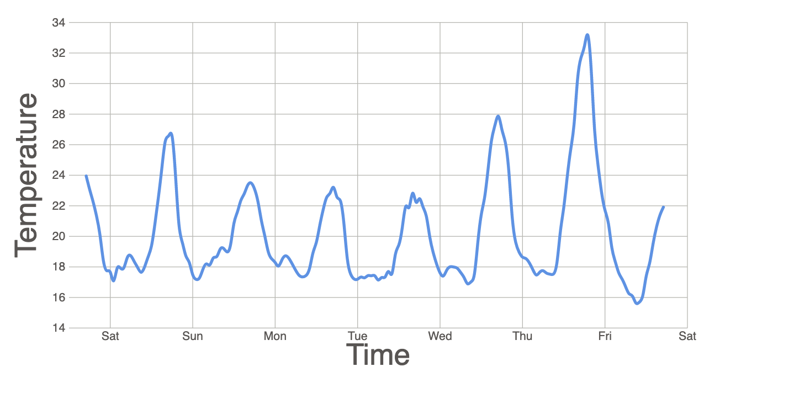
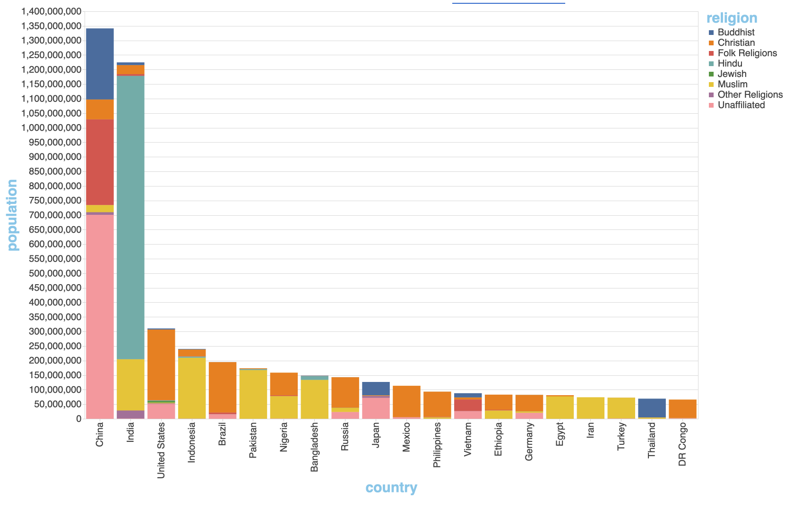
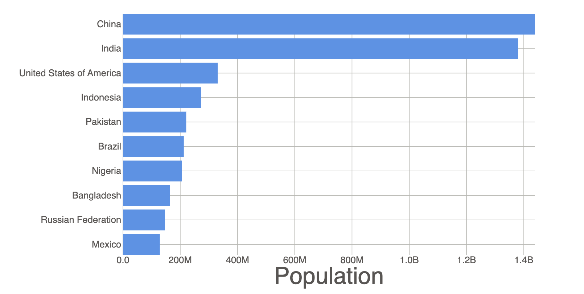
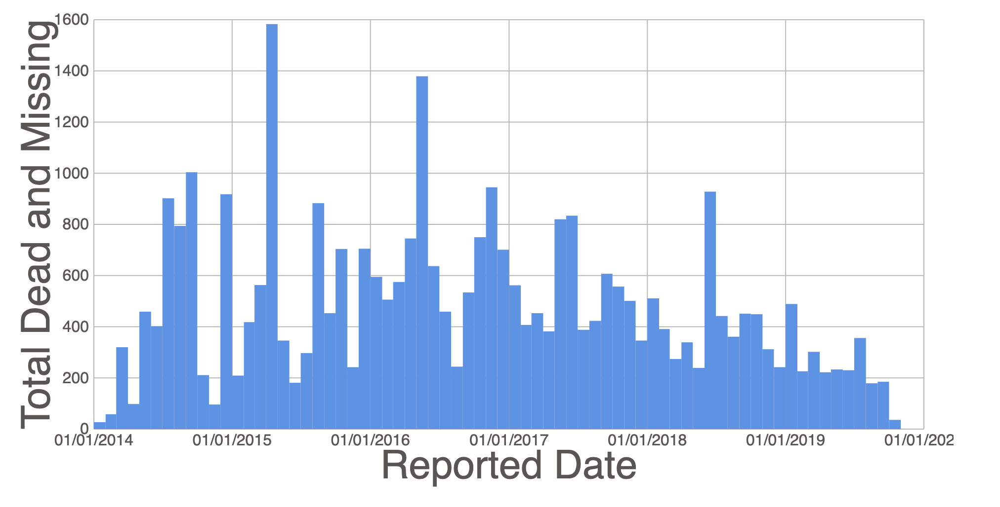
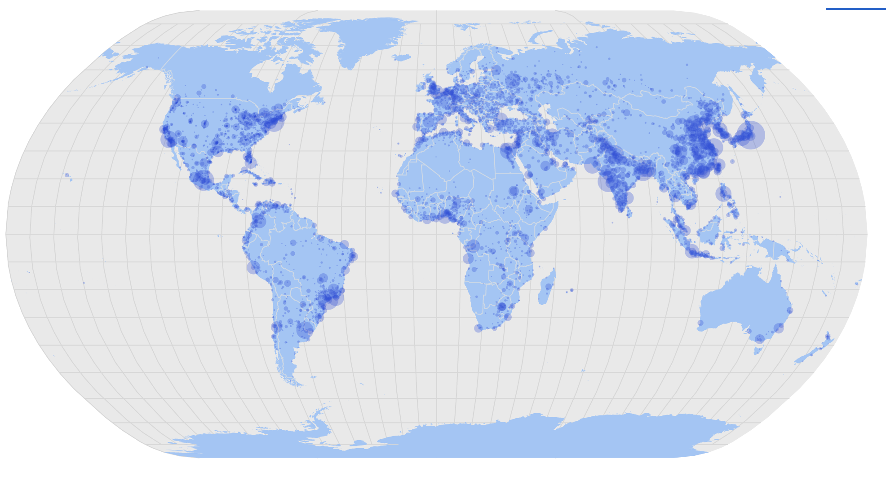

# Data Visualization demo

[Source](https://www.youtube.com/watch?v=2LhoCfjm8R4)

[Live Demo](https://samgliu.github.io/data_visualization_demo/)

# Charts

- Smiley Faces
- Mouse Following Circle
- Visualization Car  

- Visualization Color
- Visualization Plot D3  

- Visualization Population  

- Visualization Population D3  

- Visualization Migrants Histogram D3  

- Visualization Temperature  
- Visualization Temperature D3  

- Visualization WorldMap D3  

# To Do List

- Convert vega-lite-api part to TypeScript
